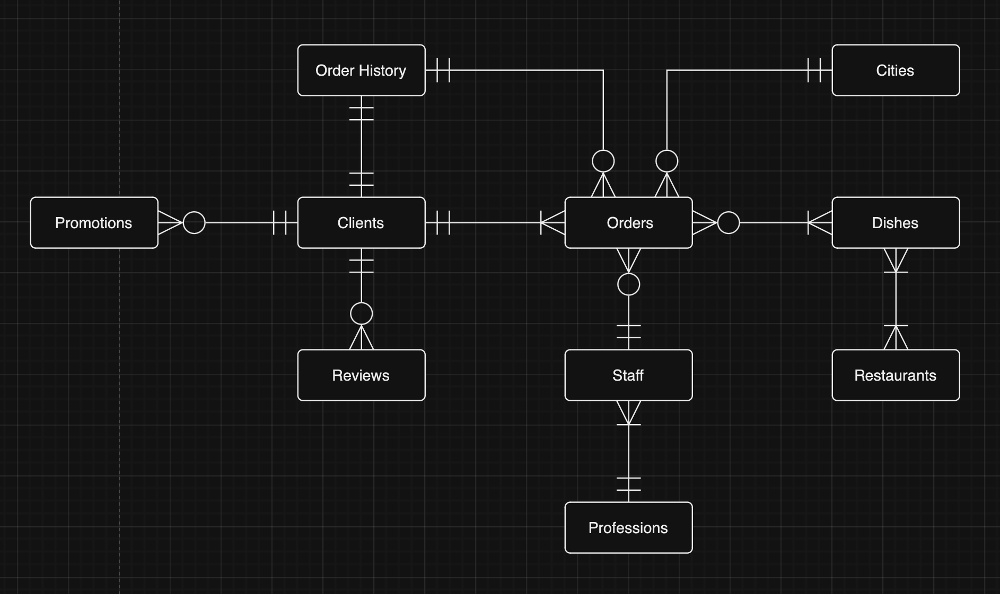
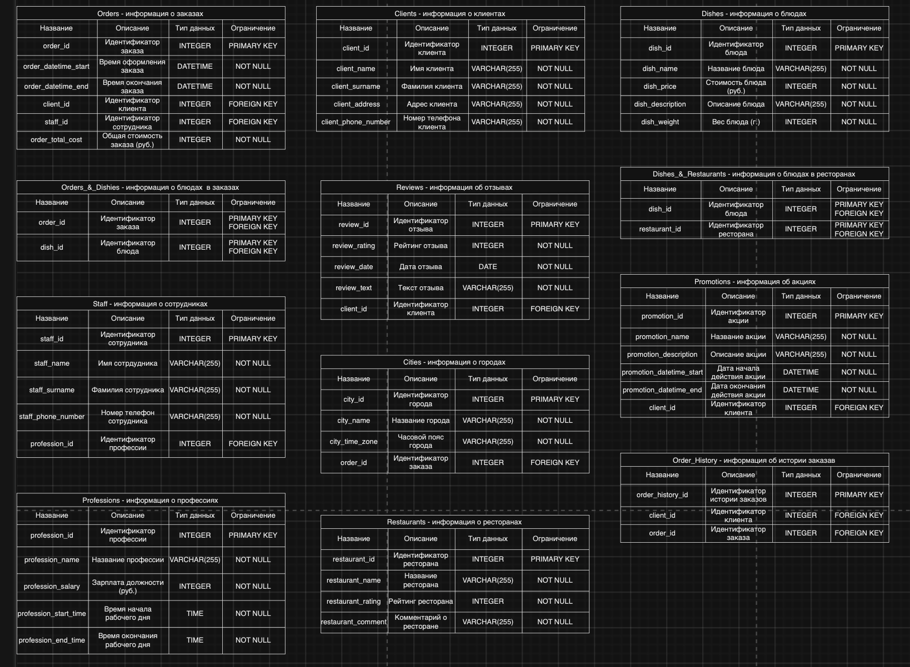

# Проект по базам данных
Тема проекта - доставка еды. Мы смоделируем все внутренние и внешние процессы на протяжении какого-то времени с помощью базы данных и языка программирования PostgreSQL.

## Защита темы. Выбор сущностей
Сущностями были выбраны: Заказы, Блюда, Ресторан, Города, Сотрудники, Профессии, Клиенты, Отзывы, Акции и Истории Заказов. Каждая из этих сущностей важна в работе доставки еды и большинство вещей можно описать через эти сущности и их атрибуты.

## Концептуальная модель
Концептуальная модель была создана в виде таблицы, на которой изображены сущности и взаимоотношения между ними.

## Логическая модель
Логическая модель была создана путем добавления атрибутов в таблицы и выделения первичных и внешних ключей. Для нормализации выбрана третья нормальная форма, поэтому появились таблицы Orders_&_Dishes и Dishes_&_Restaurants.

## Физическая модель 
Физическая модель представляет множество таблиц, каждая их которых репрезентует базу данных, так же в ней показаны типы данных и все ограничения.

## Реализация таблицы и её заполнение
С помощью PostgreSQL создадим все таблицы и зададим отношение между ними. [Инициализация.](initialization.sql)

Далее заполним каждую из таблиц данными. [Заполнение.](insertion.sql)

## Написание 20 осмысленных запросов
Ожидаемый вывод всех скриптов написан прямо в файле, запросы содержат WHERE, GROUP BY, HAVING, ORDER BY, JOIN, подзапросы. [Запросы.](requests.sql)

