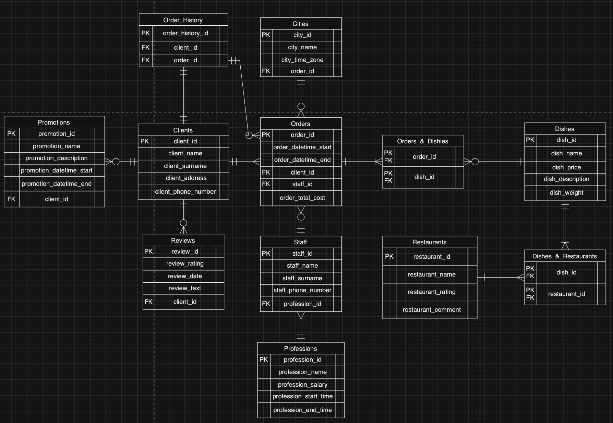

# Проект по базам данных
Тема проекта - доставка еды. Мы смоделируем все внутренние и внешние процессы на протяжении какого-то времени с помощью базы данных и языка программирования PostgreSQL.

## Защита темы. Выбор сущностей
Сущностями были выбраны: Заказы, Блюда, Ресторан, Города, Сотрудники, Профессии, Клиенты, Отзывы, Акции и Истории Заказов. Каждая из этих сущностей важна в работе доставки еды и большинство вещей можно описать через эти сущности и их атрибуты.

## Концептуальная модель
Концептуальная модель была создана в виде таблицы, на которой изображены сущности и взаимоотношения между ними.

## Логическая модель
Логическая модель была создана путем добавления атрибутов в таблицы и выделения первичных и внешних ключей. Для нормализации выбрана третья нормальная форма, поэтому появились таблицы Orders_&_Dishes и Dishes_&_Restaurants.

## Физическая модель 
Физическая модель представляет множество таблиц, каждая их которых репрезентует базу данных, так же в ней показаны типы данных и все ограничения.

## Реализация таблицы и её заполнение
С помощью PostgreSQL создадим все таблицы и зададим отношение между ними. [Инициализация.](init.sql)

Далее заполним каждую из таблиц данными. [Заполнение.](insert.sql)

## Написание 10 осмысленных запросов
Ожидаемый вывод всех скриптов написан прямо в файле, запросы содержат WHERE, GROUP BY, HAVING, ORDER BY, JOIN, подзапросы. [Запросы.](queries.sql)

## Создание представлений
Представления созданы для тех таблиц, в которых станет гораздо удобнее работать, если сгруппировать данные из нескольких таблиц. [Представления.](view.sql)

## Создание индексов
Индексы созданы для тех таблиц и атрибутов, которые используются чаще всего, чтобы ускорить исполнение запросов. Проводить индексирование для всех таблиц не стоит для экономии памяти. [Индексирование.](index.sql)

## Создание хранимых процедур или функций
Функции и процедуры созданы таким образом, чтобы они могли быть удобными и применимыми для сотрудников. Самая важная функция отсюда - это функция которая считает суммарную стоимость заказа клиента.[Процедуры и функции.](functions_procedures.sql)

## Создание триггеров
Все тригерры привязаны к функции создания нового заказа, с помощью триггеров мы можем удобным образом изменять данные таблицы.[Триггеры.](triggers.sql)
